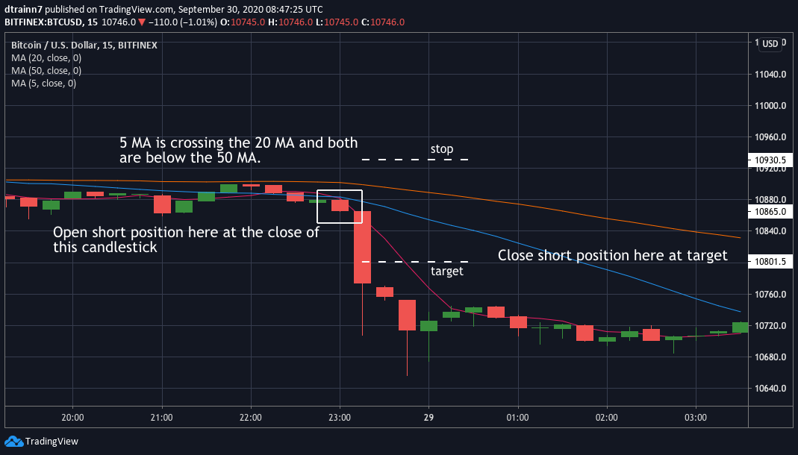

# Algorithmic trading (Bitcoin)
## Contents
(write something here)

## Background
The cryptocurrency markets have always fascinated me ever since the boom in 2017. However, it wasn't till recently that
I heard about algorithmic trading. This is essentially a way of automating trades based off some pre-set rules and conditions.
This being my first attempt, I decided to create a basic trader using the well-known moving average (MA) cross strategy. Another intention is to reveal whether or not this strategy is actually viable, given how popular it seems in the world of algo trading.

## The strategy
The main inspiration for the strategy can be found here: 
 
https://www.tradingview.com/chart/EURGBP/1ImcwzBC-The-Simplest-Scalping-Strategy-With-3-EMA-s-For-20-Pips-Per-Day/

Here are the main points:
* Buy when the 5 MA crosses from below the 20 MA to above it but only if both the 5 MA and 20 MA are above the 50 MA.
* Sell when the 5 MA crosses from above the 20 MA to below it but only if both the 5 MA and 20 MA are below the 50 MA.

The diagram below demonstrates an example of a successful short.
 

## Method
(write something here)

## Results
(write something here)

## Conclusion
(write something here)
